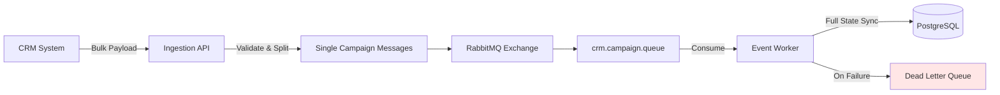

# 📦 CRM Campaign Sync – Event-Driven Microservices

## 📖 Overview

Event Synchronization System (ESS) implements an event-driven architecture to ingest and process campaign data coming from an external CRM system.
The system is designed as a simplified but production-oriented example, focusing on data consistency, scalability, resilience and decoupling, using RabbitMQ 
as a message broker and Spring Boot microservices.

It consists of two main services:

- Ingestion API (Producer) → receives and validates incoming data, then publishes messages
- Event Worker (Consumer) → processes messages asynchronously and persists data into PostgreSQL

---

## 🧱 Architecture

CRM → Ingestion API → RabbitMQ → Event Worker → PostgreSQL

### Flow:

1. CRM sends a bulk payload of campaigns
2. Ingestion API:
    - validates input
    - splits payload into single campaigns
    - publishes messages to RabbitMQ
3. Event Worker:
    - consumes messages
    - synchronizes database state
    - routes failed messages to a Dead Letter Queue (DLQ)

---

## 🧭 Architecture Diagram



---

## 📡 Service 1 – Ingestion API (Producer)

### Responsibilities

- Expose REST endpoint
- Validate incoming payload
- Split campaigns into individual messages
- Publish messages to RabbitMQ

### Endpoint

POST /api/v1/crm/sync

### Api Request Example

```bash
curl -X POST http://localhost:8080/api/v1/crm/sync \
  -H "Content-Type: application/json" \
  -H "X-API-KEY: secret-key" \
  -d @payload.json
 ```

### Payload Example

```json

[
  {
    "campaignId": "C-00088102",
    "subCampaignId": "SC-0091",
    "attendees": [
      {
        "cn": "1002001",
        "firstName": "Matteo",
        "lastName": "Ricci",
        "birthDate": "1985-05-12",
        "partnerId": "1002001",
        "isCompanion": false,
        "qrCode": "..."
      }
    ]
  }
]

```

### Notes

- `subCampaignId` can be **null**
- Companions (`isCompanion = true`) may have:
    - `cn = null`
    - `birthDate = null`


### Security

- Protected via API Key
- Header required:

X-API-KEY: <your-api-key>

- Configured in `application.yml`:

```yaml
security:
  api-key: secret-key
```

- Responses:

| Scenario                     | Response        |
|----------------------------|-----------------|
| Valid request              | 202 Accepted    |
| Invalid JSON / validation  | 400 Bad Request |
| Missing / wrong API Key    | 401 Unauthorized|

---

## 📨 Messaging (RabbitMQ)

### Exchange
`crm.exchange`

### Routing Key
`crm.campaign.created`

### Queue
- `crm.campaign.queue`
- `dlq.queue` (Dead Letter Queue for failed messages)

### Behavior

- Each campaign → **1 message**
- Messages are published asynchronously

---

## ⚙️ Service 2 – Event Worker (Consumer)

### Responsibilities

- Consume messages from RabbitMQ
- Persist data into PostgreSQL
- Maintain **full state synchronization**

### Error Handling

In case of processing failure, messages are routed to a Dead Letter Queue (DLQ).

This ensures:
- no message loss
- possibility of reprocessing failed events

---

## 🔄 Full State Synchronization

This is the **core business rule**.

### Case A – New Campaign

- Campaign does not exist → create it
- Save all attendees

### Case B – Existing Campaign

- Replace **entire attendee list**
- Remove outdated attendees

### Note:
The system is designed to treat every incoming payload as a **source of truth snapshot**, ensuring database consistency at any time.

### Implementation Strategy

```java
@OneToMany(
    mappedBy = "campaign",
    cascade = CascadeType.ALL,
    orphanRemoval = true
)
```

---

## 🧠 Design Decisions

- Event-driven architecture ensures loose coupling between services
- Full state synchronization guarantees consistency with the CRM system
- DTOs decouple API and persistence layers
- RabbitMQ enables asynchronous processing and resilience

---

## 🐳 Running the application (local environment with Docker)

The project includes a `docker-compose.yml` file located in the `infrastructure/` folder.

### Start services

```bash
cd infrastructure
docker-compose up -d
```

### Stop services

```bash
docker-compose down
```

### Services

| Service              | Port  |
|---------------------|-------|
| PostgreSQL          | 5432  |
| RabbitMQ            | 5672  |
| RabbitMQ UI console | 15672 |

### RabbitMQ Dashboard

http://localhost:15672

Credentials:

`guest / guest`


---

## 📂 Project Structure

Inside the main folder "EssProject" there are two sub-folders, one for each microservice, each containing a main and a test module.

EventWorker:

```
config/
dto/
mappers/
messaging/
models/
repos/
services/

```

IngestionAPI:

```
config/
controllers/
dto/
exceptions/
messaging/
security/
services/
    
```

There is also an "infrastructure" folder that contains the `docker-compose.yml` file to run both the microservices.

---

## 🗄️ Data Model (Database tables)

### Campaign

- `id`
- `campaignId`
- `subCampaignId`

### Attendee

- `id`
- `campaign_id` (FK)
- `cn`
- `firstName`
- `lastName`
- `birthDate`
- `partnerId`
- `isCompanion`
- `qrCode`

### Relationship

`Campaign (1) → (N) Attendee`


---

## 🚀 Tech Stack

- Java 24
- Spring Boot 4.x
- JPA / Hibernate
- Lombok
- Jakarta Bean Validation
- RabbitMQ
- PostgreSQL
- Docker / Docker Compose
- JUnit 5 + TestContainers
- SonarQube

---

## 🧪 Testing Strategy

The project includes both unit and integration tests to validate the behavior of each component and the overall message flow.

### Ingestion API

- REST layer tested using **MockMvc**
- API Key authentication is verified via filter testing
- Payload validation ensures malformed requests are rejected
- Message publishing is verified by asserting messages are correctly sent to RabbitMQ

### Messaging

- Integration tests validate interaction with RabbitMQ
- Ensure messages are correctly routed to the configured exchange and queue
- Dead Letter Queue (DLQ) behavior is verified for failed messages
- **TestContainers** are used to spin up a real RabbitMQ instance during tests, ensuring realistic and isolated test execution

### Event Worker

- Database synchronization logic is tested to ensure:
    - correct creation of new campaigns
    - full replacement of attendees on update (idempotency)
- Transactional behavior guarantees consistency during updates

---

### 👤 Author

*Romina Trazzi* 
