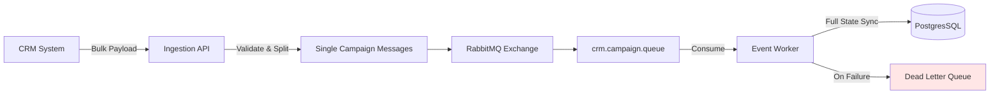
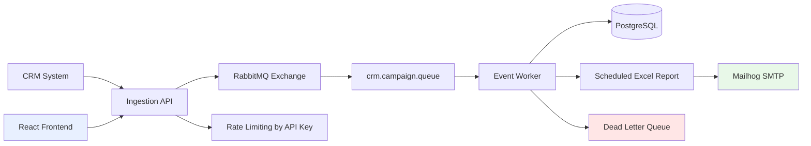

# 📦 CRM Campaign Sync – Event-Driven Microservices

## 📖 Overview

Event Synchronization System (ESS) implements an event-driven architecture to ingest and process campaign data coming from an external CRM system.
The system is designed as a simplified but production-oriented example, focusing on data consistency, scalability, resilience and decoupling, using RabbitMQ 
as a message broker and Spring Boot microservices.

It consists of two main services:

- Ingestion API (Producer) → receives and validates incoming data, then publishes messages
- Event Worker (Consumer) → processes messages asynchronously and persists data into PostgreSQL


## 📖 Project Evolution

The original scope of the project focused on asynchronous campaign synchronization between an external CRM and an internal database.

The current implementation extends that foundation with additional application modules and infrastructure components:

- a separate React frontend used to simulate CRM submissions through a visual interface
- a scheduled reporting module in the Event Worker
- Excel report generation with Apache POI
- email delivery through a local Mailhog SMTP container
- API protection with rate limiting on the Ingestion API

These additions preserve the original event-driven flow while improving usability, observability, and operational safety.

---

## 🧱 Architecture

The system is built following an event-driven architecture to ensure scalability, resilience, and decoupling between components.

CRM → Ingestion API → RabbitMQ → Event Worker → PostgreSQL

### Flow

1. The CRM sends a bulk payload containing multiple campaigns.
2. The Ingestion API:
    - validates the incoming request
    - splits the payload into individual campaign messages
    - publishes each message to RabbitMQ
3. The Event Worker:
    - consumes messages asynchronously from the queue
    - performs full-state synchronization on the database
    - routes failed messages to a Dead Letter Queue (DLQ) after retry attempts


### Extended Runtime Components

In addition to the original Producer/Consumer architecture, the project now includes:

- a standalone **React SPA frontend**
- a **scheduled reporting flow** executed by the Event Worker
- a **Mailhog container** for local email testing
- a **rate limiting layer** in the Ingestion API based on API Key identity

The extended runtime flow is therefore:

React Frontend / CRM → Ingestion API → RabbitMQ → Event Worker → PostgreSQL  
↘ Scheduled Excel Report → Mailhog
---

## 🧭 Architecture Diagram


```mermaid
flowchart LR
    CRM[CRM System] -->|Bulk Payload| API[Ingestion API]

    API -->|Validate & Split| MSG[Single Campaign Messages]

    MSG --> EXCHANGE[RabbitMQ Exchange]
    EXCHANGE --> QUEUE[crm.campaign.queue]

    QUEUE -->|Consume| WORKER[Event Worker]

    WORKER -->|Full State Sync| DB[(PostgresSQL)]

    WORKER -->|On Failure| DLQ[Dead Letter Queue]

    style DLQ fill:#ffe6e6
    
```
### Extended Architecture Diagram


```mermaid
flowchart LR
    CRM[CRM System] --> API[Ingestion API]
    UI[React Frontend] --> API

    API --> EXCHANGE[RabbitMQ Exchange]
    EXCHANGE --> QUEUE[crm.campaign.queue]

    QUEUE --> WORKER[Event Worker]
    WORKER --> DB[(PostgreSQL)]

    WORKER --> REPORT[Scheduled Excel Report]
    REPORT --> MAIL[Mailhog SMTP]

    API --> RL[Rate Limiting by API Key]
    WORKER --> DLQ[Dead Letter Queue]

    style DLQ fill:#ffe6e6
    style UI fill:#e8f0ff
    style MAIL fill:#e8f8e8
```

---

## 📡 Service 1 – Ingestion API (Producer)

### Responsibilities

- Expose REST endpoint
- Validate incoming payload
- Split campaigns into individual messages
- Publish messages to RabbitMQ

### Endpoint

POST /api/v1/crm/sync

### Api Request Example

```bash
curl -X POST http://localhost:8080/api/v1/crm/sync \
  -H "Content-Type: application/json" \
  -H "X-API-KEY: secret-key" \
  -d @payload.json
 ```

### Payload Example

```json

[
  {
    "campaignId": "C-00088102",
    "subCampaignId": "SC-0091",
    "attendees": [
      {
        "cn": "1002001",
        "firstName": "Matteo",
        "lastName": "Ricci",
        "birthDate": "1985-05-12",
        "partnerId": "1002001",
        "isCompanion": false,
        "qrCode": "..."
      }
    ]
  }
]

```

### Notes

- `subCampaignId` can be **null**
- Companions (`isCompanion = true`) may have:
    - `cn = null`
    - `birthDate = null`


### Security

- Protected via API Key
- Header required:

X-API-KEY: <your-api-key>

- Configured in `application.yml`:

```yaml
security:
  api-key: secret-key
```

- Responses:

| Scenario                   | Response          |
|----------------------------|-------------------|
| Valid request              | 202 Accepted      |
| Invalid JSON / validation  | 400 Bad Request   |
| Missing / wrong API Key    | 401 Unauthorized  |

---

## 📨 Messaging (RabbitMQ)

### Exchange
`crm.exchange`

### Routing Key
`crm.campaign.created`

### Queue
- `crm.campaign.queue`
- `dlq.queue` (Dead Letter Queue for failed messages)

### Behavior

- Each campaign → **1 message**
- Messages are published asynchronously


## 🚦 API Protection – Rate Limiting

The Ingestion API is protected by a rate limiting layer to prevent abuse or accidental request flooding.

### Policy

Rate limiting is applied per caller identity using the `X-API-KEY` header.

Example policy:

- maximum **5 requests per minute** for each API Key

### Implementation Notes

- the limit check happens before request body validation
- requests over the configured threshold are rejected immediately
- the API returns:

`429 Too Many Requests`

### Suggested Technology

The rate limiting layer can be implemented using **Bucket4j** integrated through a Spring `Filter` or `HandlerInterceptor`.

### Configurability

The following values can be externalized in `application.yml`:

- enabled flag
- request capacity
- refill window
- refill amount
---

## ⚙️ Service 2 – Event Worker (Consumer)

### Responsibilities

- Consume messages from RabbitMQ
- Persist data into PostgreSQL
- Maintain **full state synchronization**

### Error Handling

In case of processing failure, messages are routed to a Dead Letter Queue (DLQ).

This ensures:
- no message loss
- possibility of reprocessing failed events

---

## 🔄 Full State Synchronization

This is the **core business rule**.

### Case A – New Campaign

- Campaign does not exist → create it
- Save all attendees

### Case B – Existing Campaign

- Replace **entire attendee list**
- Remove outdated attendees

### Note:
The system is designed to treat every incoming payload as a **source of truth snapshot**, ensuring database consistency at any time.

### Implementation Strategy

```java
@OneToMany(
    mappedBy = "campaign",
    cascade = CascadeType.ALL,
    orphanRemoval = true
)
```

## 📊 Reporting Module 

The Event Worker has been extended with a scheduled reporting module responsible for generating campaign summary reports from the synchronized database state.

### Responsibilities

- Load the current campaign data from PostgreSQL
- Aggregate campaign and attendee information into report-ready structures
- Generate an Excel workbook (`.xlsx`) using Apache POI
- Build summary tables and chart sheets
- Send the generated report as an email attachment to the configured recipient

### Report Format

The reporting module generates an Excel file containing:

- campaign summary data
- attendee detail tables grouped by campaign
- dashboard-oriented sheets for aggregated analysis
- chart sheets generated programmatically with Apache POI

The base report requirement is to provide one table for each campaign and list the main attendee fields such as:

- First Name
- Last Name
- CN
- Birth Date
- Companion

### Scheduling

Report generation is executed automatically through Spring scheduling.

The schedule is configurable in `application.yml` using either:

- a Cron expression
- a fixed delay configuration

### Email Delivery

Once generated, the Excel report is sent by email as an attachment using Spring Mail.

In local development, email delivery is tested using Mailhog.


## 💻 Service 3 – Simulation Frontend (React SPA)


To simplify manual testing and provide a more realistic CRM simulation flow, the project includes a separate frontend application built as a client-side Single Page Application.

The frontend is fully decoupled from the Java backend and runs on its own development server.

### Responsibilities

- Provide a visual form to compose campaign payloads
- Manage dynamic attendee rows
- Send authenticated requests to the Ingestion API
- Display user feedback for successful and failed submissions

### Main Features

- campaign form section:
    - `campaignId`
    - `subCampaignId`
- attendee dynamic section:
    - `cn`
    - `firstName`
    - `lastName`
    - `birthDate`
    - `partnerId`
    - `isCompanion`
    - `qrCode`
- button to add or remove attendees dynamically
- JSON payload generation based on the agreed contract
- HTTP POST integration with `/api/v1/crm/sync`
- visual feedback for:
    - `202 Accepted`
    - `400 Bad Request`
    - `401 Unauthorized`
    - `429 Too Many Requests`

### Frontend Integration Notes

Because the frontend runs on a different origin, the Ingestion API must explicitly allow the frontend origin through CORS configuration.

Each request sent by the frontend includes the custom authentication header:

`X-API-KEY: <your-api-key>`

### Suggested Frontend Structure

```text
frontend-app/
├── src/
│   ├── components/
│   ├── services/
│   ├── hooks/
│   ├── utils/
│   ├── pages/
│   └── App.jsx
├── package.json
└── vite.config.js
```
---

## 🧠 Design Decisions

- Event-driven architecture ensures loose coupling between services
- Full state synchronization guarantees consistency with the CRM system
- DTOs decouple API and persistence layers
- RabbitMQ enables asynchronous processing and resilience

## 🧠 Internal Reporting Pipeline

The reporting workflow is structured in multiple steps:

1. retrieve synchronized campaign data from the database
2. transform domain data into aggregation DTOs
3. build workbook sheets for summary and detailed campaign data
4. generate dashboard charts from support tables
5. export the workbook to a binary file
6. attach the generated file to an outgoing email

This separation keeps reporting concerns isolated and makes the Excel generation layer easier to maintain and extend.

## ⚙️ Fault Tolerance

The system ensures resilience through:

- Retry mechanism (max 3 attempts)
- Dead Letter Queue (DLQ) for failed messages
- Idempotent processing logic in the consumer
- Transactional database operations

Failed messages are automatically routed to the DLQ after retries are exhausted.

---

## 🐳 Running the application (local environment with Docker)

The project includes a `docker-compose.yml` file located in the `infrastructure/` folder.

### Start services

```bash
cd infrastructure
docker-compose up -d
```

### Stop services

```bash
docker-compose down
```

### Services

| Service             | Port  |
|---------------------|-------|
| PostgreSQL          | 5432  |
| RabbitMQ            | 5672  |
| RabbitMQ UI console | 15672 |
| Mailhog             | 1025  |
| Mailhog UI console  | 8025  |
| React SPA           | 3000  |


### RabbitMQ Dashboard

http://localhost:15672

Credentials:

`guest / guest`


### Mailhog Dashboard

http://localhost:8025
---


## 📂 Project Structure

Inside the main folder "EssProject" there are two sub-folders, one for each microservice, each containing a main and a test module.

EventWorker:

```
config/
dto/
mappers/
messaging/
models/
repos/
services/
helper/

```

IngestionAPI:

```
config/
controllers/
dto/
exceptions/
messaging/
security/
services/
    
```

Frontend

```
components/
api/
helpers/
style/
``` 

There is also an "infrastructure" folder that contains the `docker-compose.yml` file to run both the microservices.

---

## 🗄️ Data Model (Database tables)

### Campaign

- `id`
- `campaignId`
- `subCampaignId`

### Attendee

- `id`
- `campaign_id` (FK)
- `cn`
- `firstName`
- `lastName`
- `birthDate`
- `partnerId`
- `isCompanion`
- `qrCode`

### Relationship

`Campaign (1) → (N) Attendee`


---

## 🚀 Tech Stack

- Java 24
- Spring Boot 4.x
- JPA / Hibernate
- Lombok
- Jakarta Bean Validation
- RabbitMQ
- PostgreSQL
- Docker / Docker Compose
- JUnit 5 + TestContainers
- SonarQube


### Additional Technologies Introduced in the Extended Scope

- React
- Vite
- Axios / Fetch API
- Apache POI
- Spring Scheduling
- Spring Mail
- Mailhog
- Bucket4j

---

## 🧪 Testing Strategy

Integration tests are implemented using Testcontainers:

- RabbitMQ container for messaging
- PostgreSQL container for persistence
- Full end-to-end flow testing

Containers are started automatically during test execution.

### Ingestion API

- REST layer tested using **MockMvc**
- API Key authentication is verified via filter testing
- Payload validation ensures malformed requests are rejected
- Message publishing is verified by asserting messages are correctly sent to RabbitMQ

### Messaging

- Integration tests validate interaction with RabbitMQ
- Ensure messages are correctly routed to the configured exchange and queue
- Dead Letter Queue (DLQ) behavior is verified for failed messages
- **TestContainers** are used to spin up a real RabbitMQ instance during tests, ensuring realistic and isolated test execution

### Event Worker

- Database synchronization logic is tested to ensure:
    - correct creation of new campaigns
    - full replacement of attendees on update (idempotency)
- Transactional behavior guarantees consistency during updates

### Extended Test Coverage

The extended scope introduces additional testing areas.

#### Frontend

- component rendering tests for dynamic attendee rows
- payload generation verification
- API integration testing with mocked HTTP responses
- feedback rendering for `202`, `400`, `401`, and `429`


---

### 👤 Author

*Romina Trazzi* 
